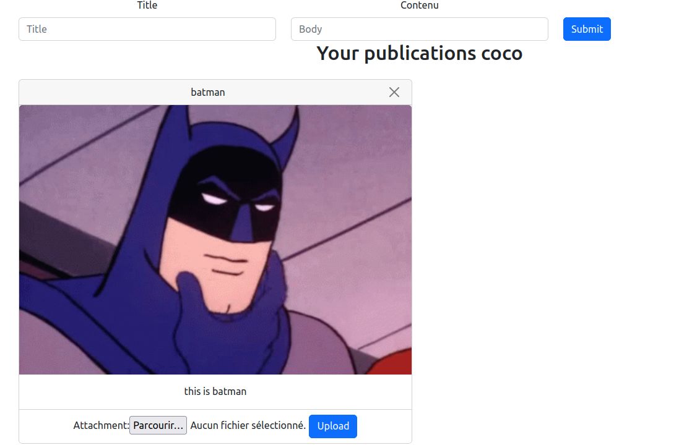

# Postgram

## How to start?

# Postgram 📸

## How does it work? 🚀

- 👉 `git clone https://github.com/cosaph/postagram_ensai.git`
- 👉 `cd postagram_ensai`
- 👉 `make all`

Follow the instructions on the command line to get started with the app.

## Don't forget to close the app! 🛑

To clean up and close the app, run:

- 👉 `make clean`